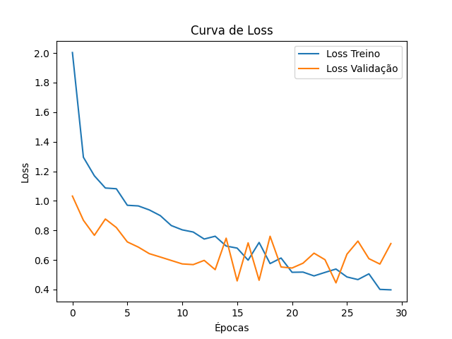
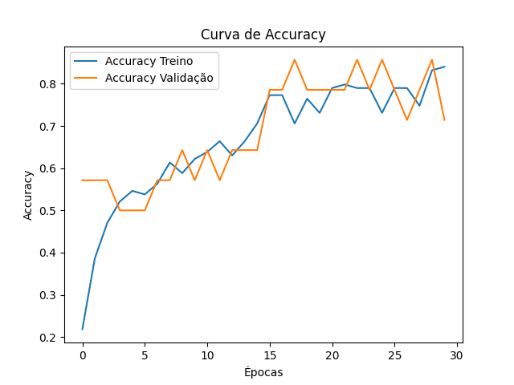

# Classificador Carros com Visão Computacional

Projeto de Visão Computacional para classificação de imagens de carros utilizando Redes Neurais Convolucionais (CNN) com TensorFlow/Keras e visualização de resultados com OpenCV.

## 🚗 Classes
- Bugatti
- Ferrari
- Lamborghini
- Porsche

## 🧠 Descrição do Projeto

Desenvolvimento de uma Rede Neural Convolucional (CNN) do zero para classificar imagens de carros esportivos. Este projeto contempla todo o pipeline de Machine Learning, desde o pré-processamento das imagens até a inferência em imagens reais.
O modelo treinado é salvo e reutilizado em scripts independentes, permitindo separação entre as etapas de treinamento e predição.

## ⚙️ Pipeline do Projeto

1. Carregamento e organização do dataset
2. Pré-processamento das imagens (redimensionamento e normalização)
3. Data augmentation para aumento do dataset
4. Treinamento da CNN
5. Avaliação do modelo (loss e accuracy)
6. Salvamento do modelo treinado
7. Inferência em imagens externas
8. Visualização das predições com OpenCV

## 🧱 Arquitetura da CNN
- Camadas convolucionais (Conv2D + ReLU)
- Camadas de pooling (MaxPooling2D)
- Camada Flatten
- Camadas densas (Dense + Dropout)
- Camada de saída com Softmax

## 📊 Avaliação do Modelo
O desempenho do modelo é analisado por meio das curvas de loss e accuracy para os conjuntos de treino e validação, permitindo identificar convergência e possíveis sinais de overfitting.

## 🖼️ Exemplo de Predição
Abaixo estão exemplos de imagens classificadas corretamente pelo modelo,
com visualização das predições utilizando OpenCV.

## 📂 Estrutura do Projeto
├── train.py #Treinamento da CNN e geração das métricas
├── predict.py #Inferência utilizando modelo treinado
├── modelo_cnn_bflp.keras #Modelo treinado salvo
├── classes_carros.json #Mapeamento das classes
├── loss.png
├── accuracy.png
├── dataset/
│ ├── train/
│ └── valid/
├── bugatti_car_valid.png
├── ferrari_car_valid.png
├── lamborghini_car_valid.png
└── porsche_car_valid.png